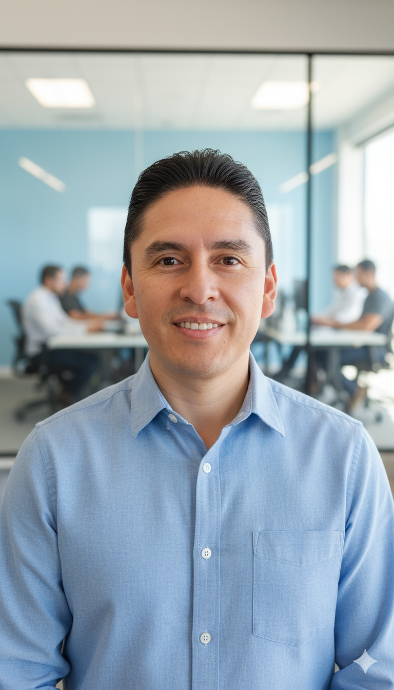

  
  

    Hola, soy Pablo Herrera
    
    🚀 Profesional de Tecnología con enfoque en QA Automation y Desarrollo de Software

    Soy un profesional apasionado por la tecnología con más de 10 años de experiencia en la industria. Mi trayectoria combina un sólido background en Desarrollo de Software y una especialización profunda en Control de Calidad y Automatización (QA Automation).

    Mi objetivo es claro: ayudar a los equipos de software a alcanzar la excelencia, garantizando productos de alta calidad, escalables y confiables.
  

---

## 🛠️ Mis Habilidades Técnicas

Como **QA Automation Engineer**, poseo experiencia práctica en la creación e implementación de *frameworks* de automatización robustos, utilizando herramientas y lenguajes líderes en el sector:

| Categoría | Tecnologías y Herramientas Clave |
| :--- | :--- |
| **Lenguajes de Programación** | Java, Python, JavaScript |
| **Herramientas de QA** | Selenium WebDriver, WebdriverIO, Cypress, Postman |
| **Metodologías** | Agile (Scrum/Kanban), Testing de Rendimiento, Testing Funcional |
| **Otros** | Git, Integración Continua (CI/CD) |

---

## 💼 Experiencia Laboral Destacada

Mi carrera se ha desarrollado en diversas empresas de alto impacto en Latinoamérica, abordando roles clave:

* **Galileo Financial Technologies** (2022 - Actualidad)
    * *Rol:* QA Automation Engineer.
    * *Proyectos Clave:* Diners Ecuador, Crediclub México, Patagonia Argentina.
* **EPMAPS** (2014 - 2022)
    * *Rol:* Jefe de Desarrollo de Aplicaciones.
* **CNT** (2012 - 2013)
    * *Rol:* Control de Calidad.
* **Tata Consultancy Services** (2010)
    * *Proyecto:* Banco Pichincha.
    * *Foco:* Performance Testing.

---

## 💡 Mi Filosofía y Pasión

Lo que más me motiva es el **crecimiento colectivo**. Me apasiona:

1.  **Compartir Conocimiento:** Contribuir al desarrollo profesional de mis compañeros de equipo y la comunidad.
2.  **Liderazgo Técnico:** Guiar a los equipos a través de desafíos técnicos y metodológicos para mejorar procesos.
3.  **Participación Activa:** Creer en el valor de la comunidad tecnológica y participar activamente en ella.

Desde 2024, he estado participando como **ponente** en eventos de tecnología, incluyendo **Nerdearla** y **Testing Perú**, compartiendo contenido sobre diversos temas técnicos.

---

## 🔗 Conéctate Conmigo

Estoy siempre abierto a discutir nuevas ideas, proyectos de automatización, o cualquier tema relacionado con tecnología. ¡Hablemos!

| Plataforma | Enlace |
| :--- | :--- |
| **LinkedIn** | [https://www.linkedin.com/in/pablo-herrera-ec/](https://www.linkedin.com/in/pablo-herrera-ec/) |
| **YouTube** | [https://www.youtube.com/@TestingConPabloHerrera](https://www.youtube.com/@TestingConPabloHerrera) |